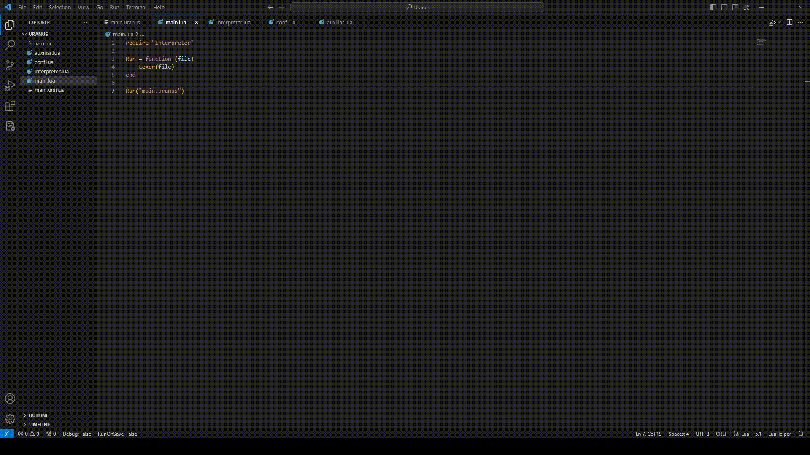

#  Uranus   

Uranus é uma linguaguem de progamação feita em cima do lua em desenvolvimento.

Functions:
 `write` - Escreva alguma coisa

Exemplos:

 Hello World
 `write("Hello World")`

 Váriavel
 `word = "Uranus"
 write(word)`

 Anotação
 `word = "Uranus v0.1"-- Define váriavel 
 write(word)--Escreve com o valor da váriavel`
 
