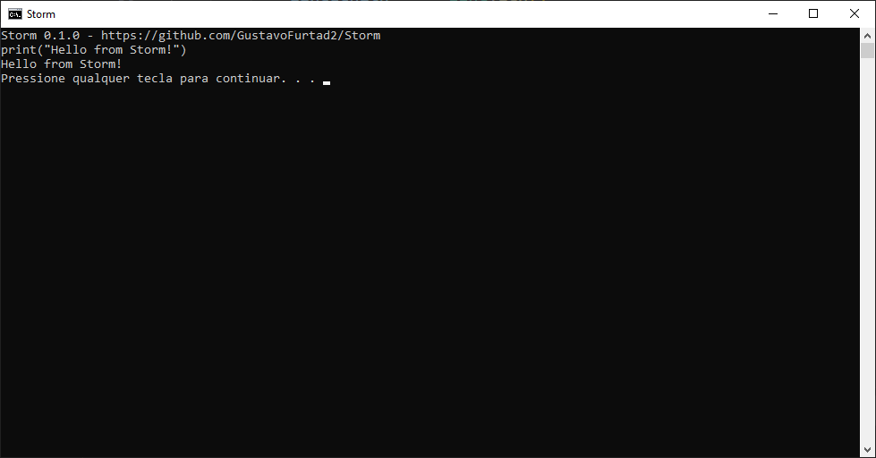

 ### Storm 0.1.0

Storm is an interpreted language made in Lua languague

Progression to first released version: `40%`

To-do list:

Syntax
```
Call Functions   [V]
Create Functions [V]
Variables        [V]
Conditionals     [X]
Switch Casew     [X]
Loops            [X]
```

Operators
```
Aritmetic Operators [V]
Logic Operators [V]
Relational Operators [V]
```

Types
```
Number [V]
String [V]
Function [V]
Object [X]
Class [X]
```

Others
```
Standart Librarys [X]
Embedding C++ [X]
Multithreading(with C++) [X]
Standart Librarys [X]
```

<BR>

